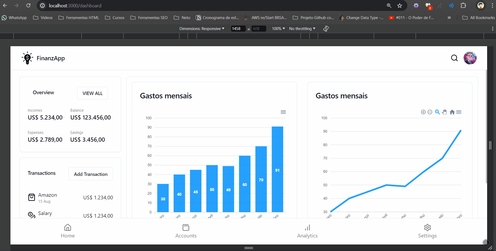

# FinanzApp with Next.js
Este é um projeto de controle financeiro utilizando Next.js.
## Sobre o projeto:
Uma breve descrição da estrutura do projeto: O projeto ainda está em desenvolvimento então não tem estrutura pronta, mas o projeto sera um SaaS de controle financeiro pessoal, para aplicativos desktop e mobile.


## Requisitos

Node.js (versão 14.x ou superior)
npm (geralmente vem junto com o Node.js) ou yarn

## Configuração do Ambiente

1. Clone o repositório para o seu ambiente local:

```bash
git clone https://github.com/seu-usuario/seu-repositorio.git
Navegue até o diretório do projeto:
bash
Copy code
cd seu-repositorio
Instale as dependências do projeto:
Se estiver usando npm:

bash
Copy code
npm install
Se estiver usando yarn:

bash
Copy code
yarn install
Executando o Projeto
Para iniciar o servidor de desenvolvimento, utilize:

Se estiver usando npm:

bash
Copy code
npm run dev
Se estiver usando yarn:

bash
Copy code
yarn dev
O servidor de desenvolvimento será iniciado e você poderá acessar o projeto em http://localhost:3000.

Scripts Disponíveis
No diretório do projeto, você pode executar os seguintes comandos:

npm run dev ou yarn dev
Inicia o servidor de desenvolvimento.

npm run build ou yarn build
Compila o projeto para produção na pasta .next.

npm start ou yarn start
Inicia o servidor em modo de produção. Certifique-se de ter rodado npm run build ou yarn build antes.

npm run lint ou yarn lint
Executa o linter para encontrar e corrigir problemas no código.
```

#### Contribuição

Contribuições são bem-vindas! Sinta-se à vontade para abrir uma issue ou um pull request.